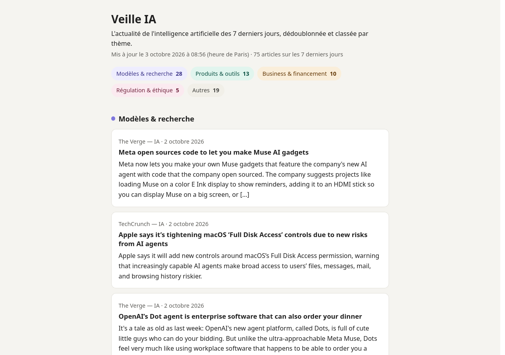
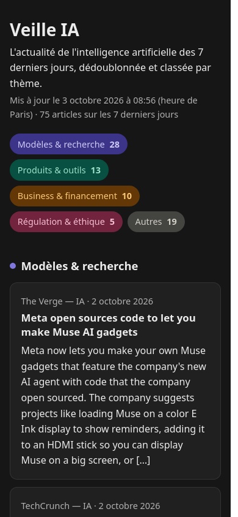

# Veille IA

*[Français](README.md) · English*

A web page that gathers the news about artificial intelligence every day, with duplicates grouped and articles sorted by theme, from French and English-language sources. The page and the project documents are in French.

> **Status:** scoping (J0) completed on 30 September 2026; collection (J1) completed on 30 September 2026; processing (J2) completed on 1 October 2026; delivery (J3): V1 online on 2 October 2026, milestone to be closed after the first automatic update.

**Live page:** [stryxman.github.io/veille-ia](https://stryxman.github.io/veille-ia/) — updated automatically every day (runs scheduled around 6:15, 12:15 and 18:15, Paris time; one hour earlier in winter time).

| On a computer (light mode) | On a phone (dark mode) |
|---|---|
|  |  |

## The need

AI news is scattered across many sites and highly redundant: the same announcement is picked up everywhere on the same day. Following this flow takes time and produces many duplicates.

## The solution

1. **Collection** of 6 RSS feeds, 4 in English and 2 in French ([sources and why they were chosen](docs/sources.md), in French). A failing source does not stop the others.
2. **Processing**: text cleaning, only the last 7 days kept, duplicates grouped (the retained article comes from the most reliable source, the others are listed under "Aussi couvert par", i.e. "Also covered by"), excerpt completed from the article page when the feed gives none, classification by theme using keywords.
3. **Delivery**: a single web page, in French, readable on a phone, in light or dark mode, with no account or installation.
4. **Automatic publication** three times a day on GitHub Pages; if no source answers, the previous page stays online.

```
config/sources.yaml ─► collect ─► process ─► enrich ─► render ─► site/index.html ─► GitHub Pages
config/themes.yaml ─────────────────┘
```

Sources and themes are set in two configuration files, without touching the code. The project costs nothing: public repository, GitHub Actions and GitHub Pages.

## The approach

The project is run in short milestones, with project management documents kept up to date (in French):

| Milestone | Content | Date |
|---|---|---|
| J0 — Scoping | Specification, sources, decisions, risks | 30 September 2026 |
| J1 — Collection | Reading the RSS feeds | 30 September 2026 |
| J2 — Processing | Cleaning, duplicates, classification | 1 October 2026 |
| J3 — Delivery | Web page, daily publication: V1 online | 2 October 2026 |
| J4 — Finishing | Missing excerpts, language model study, themes, documentation, project report | target: 6 October 2026 |

- **Recorded decisions**: every structural choice is recorded with the options considered and its rationale, then approved by the project manager ([decision log](docs/decisions.md)).
- **Tracked risks**: likelihood, impact and measures, reviewed at the end of each milestone ([risk register](docs/risques.md)).
- **Quality control**: acceptance test of each feature before its issue is closed, criterion by criterion with evidence, independent verification of the sources and documentation consistency check on every change ([D12](docs/decisions.md#d12--contrôle-qualité)); independent code review at the end of each milestone; automated tests and code checks on every pull request ([specification §6](docs/cahier-des-charges.md#6-exigences-non-fonctionnelles), [D14](docs/decisions.md#d14--outillage-de-développement)).
- **Tracking**: [milestones](https://github.com/Stryxman/veille-ia/milestones), [issues](https://github.com/Stryxman/veille-ia/issues) and [project board](https://github.com/users/Stryxman/projects/1).

## Known limitations

- Keyword classification remains approximate: some articles end up in "Autres" ("Other") or in a neighbouring theme ([R2](docs/risques.md)). A language model was studied and is not adopted for now ([D19](docs/decisions.md#d19--modèle-de-langage-llm)).
- Only near-identical titles are recognised as duplicates: the same news item with different titles in French and English is not grouped ([R12](docs/risques.md)).
- Some article pages refuse automated reading; their articles without an excerpt in the feed stay without an excerpt ([sources](docs/sources.md)).
- GitHub guarantees neither the time nor even the execution of scheduled runs, hence three slots a day ([specification §4.4](docs/cahier-des-charges.md#44-automatisation), [R3](docs/risques.md)).

## Development

```bash
python3 -m venv .venv
.venv/bin/pip install -e ".[dev]"
.venv/bin/pytest          # tests (no network access)
.venv/bin/ruff check .    # code quality
.venv/bin/ruff format --check .   # code formatting
.venv/bin/python -m veille.render --output site   # builds the page in site/index.html
```

## Project documents (in French)

| Document | Content |
|---|---|
| [Specification](docs/cahier-des-charges.md) | Context, objectives, scope, success criteria, schedule |
| [Sources](docs/sources.md) | Sources followed and why they were chosen |
| [Decision log](docs/decisions.md) | Structural choices, options considered, rationale |
| [Risk register](docs/risques.md) | Risks, likelihood, impact, measures and implementation milestone |
